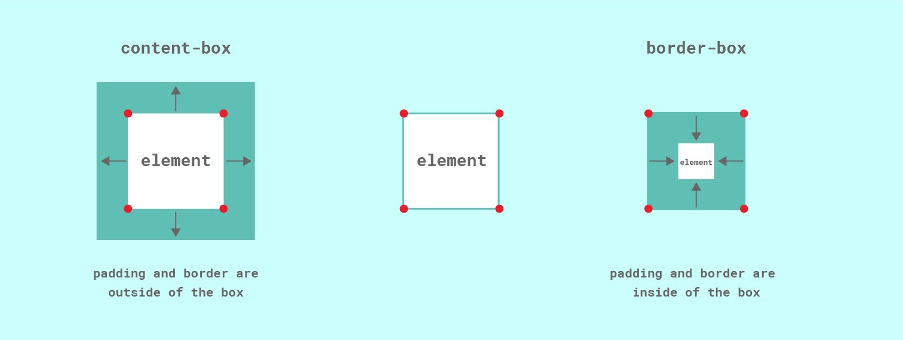
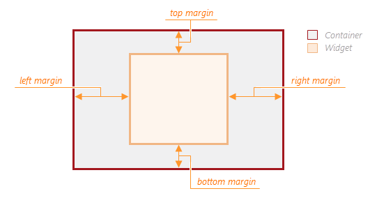

# html-css-javascript: Basics

Extension i used:
```sh
npm install -g live-server  # Install Live Server globally  
npm install emmet  # Emmet is usually built into VS Code, but you can install it separately if needed  
```


## 📌Topics Covered in This Basic Project:
* HTML structure
* CSS structure
* JavaScript structure
* HTML5 elements
* HTML headers
* CSS headers
* Submenus
* Sliders
* JavaScript functionality
* Responsive design


## 📖 Guides / References

#### CSS3 Box Model
>(Understanding how elements are structured in CSS, including content, padding, border, and margin.) 


#### Box Sizing
>(How box-sizing affects element dimensions and layout in CSS.)


#### Margin
>(Spacing around elements to control layout and positioning.)


## 🚀 Final Output
Below is the final output when running the source code:
